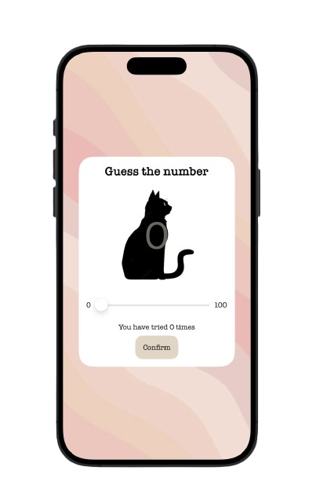
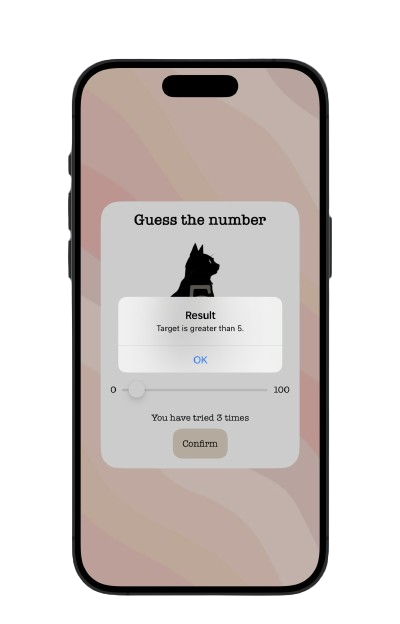
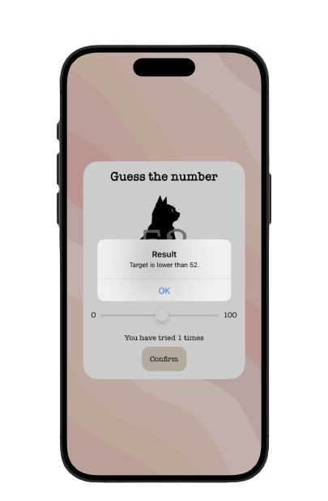
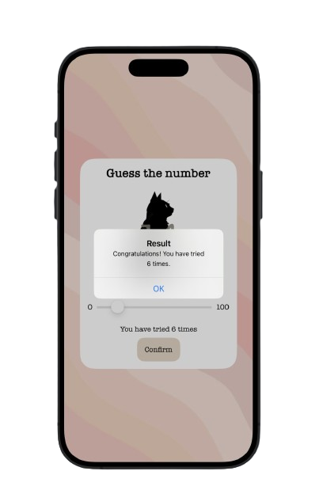

# Number guessing game

### ฟังก์ชันการทำงาน

- เกมจะทำการสุ่มตัวเลขระหว่าง 0 - 100 เพื่อให้ผู้เล่นทาย
- ผู้เล่นสามารถเลื่อน slider bar เพื่อทายตัวเลขได้\

-  เมื่อผู้เล่นกดปุ่ม Confirm จะมี pop up บอกผลการทายว่าเป้าหมายเป็นเลขสูงกว่า, ต่ำกว่า หรือ ทายถูก\
\

-  ทุกครั้งที่กดปุ่ม Confirm แอพจะนับจำนวนครั้งที่ผู้เล่นทาย
-  เมื่อผู้เล่นทายถูก เกมจะบอกจำนวนครั้งที่ผู้เล่นใช้ในการทาย และทำการเริ่มเกมใหม่\

   
Click [here](https://drive.google.com/file/d/1S9ZvX1F8HQ2TQVEIOrXdZrKpGkX0XQnp/view?usp=sharing) for clip demo.

**Supapan Ngorsakun**